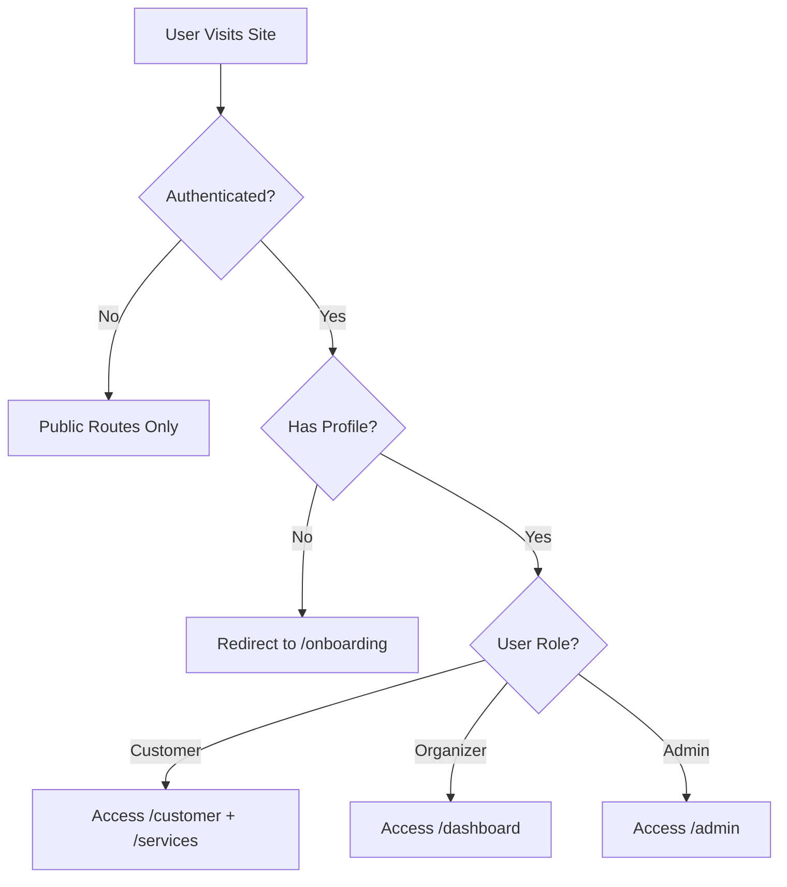

# EasyTask AI - Complete Application Documentation

## 📋 Table of Contents
1. [Application Overview](#application-overview)
2. [Technology Stack](#technology-stack)
3. [Architecture](#architecture)
4. [Database Schema](#database-schema)
5. [User Flows](#user-flows)
6. [Features & Functionality](#features--functionality)
7. [Potential Issues](#potential-issues)
8. [Improvement Suggestions](#improvement-suggestions)
9. [Performance Optimizations](#performance-optimizations)

---

## 🎯 Application Overview

**EasyTask AI** is a marketplace platform connecting event organizers (caterers, decorators, photographers, etc.) with customers planning events. It facilitates service discovery, booking, calendar management, and payments.

### Core Value Proposition
- **For Customers:** Browse verified service providers, compare prices, book instantly
- **For Organizers:** List services, manage bookings, control availability via calendar
- **For Platform:** Commission-based revenue model with secure payment processing

### Key Metrics (from landing page)
- 500+ Event Organizers
- 10,000+ Events Hosted
- 4.9 Average Rating
- 98% Satisfaction Rate

---

## 🛠 Technology Stack

### Frontend
- **Framework:** Next.js 16.1.0 (App Router with Turbopack)
- **Language:** TypeScript 5
- **UI Library:** React 19.2.3
- **Styling:** Tailwind CSS 4 + tw-animate-css
- **Components:** Radix UI primitives (Dialog, Dropdown, Tabs, etc.)
- **Icons:** Lucide React
- **Forms:** React Hook Form + Zod validation
- **Notifications:** Sonner (toast notifications)
- **Date Handling:** react-datepicker + date-fns

### Backend & Services
- **Authentication:** Clerk (v6.36.5)
- **Database:** Supabase (PostgreSQL)
- **ORM/Client:** @supabase/supabase-js (v2.89.0)
- **Middleware:** Clerk + Supabase SSR

### Development Tools
- **Package Manager:** npm
- **Linting:** ESLint 9
- **Build Tool:** Next.js with Turbopack

---

## 🏗 Architecture

### Application Structure

```
src/
├── app/                          # Next.js App Router
│   ├── (auth)/                   # Auth routes (grouped)
│   │   ├── login/
│   │   └── register/
│   ├── (marketplace)/            # Public marketplace routes
│   │   ├── services/             # Browse services
│   │   ├── book/                 # Booking flow
│   │   └── my-bookings/          # Customer bookings
│   ├── dashboard/                # Organizer dashboard
│   │   ├── services/             # Manage services
│   │   ├── bookings/             # View bookings
│   │   └── calendar/             # Calendar management
│   ├── customer/                 # Customer dashboard
│   ├── admin/                    # Admin panel
│   ├── onboarding/               # User onboarding
│   └── page.tsx                  # Landing page
├── components/
│   ├── calendar/                 # Calendar components
│   ├── layout/                   # Navbar, Footer
│   └── ui/                       # Reusable UI components
├── hooks/
│   ├── useCalendarRealtime.ts    # Real-time calendar sync
│   └── useBlockedDates.ts        # Date blocking utilities
├── lib/
│   ├── supabase/                 # Supabase clients
│   ├── clerk-utils.ts            # Clerk helpers
│   ├── supabase-data.ts          # Database queries
│   └── database.types.ts         # TypeScript types
├── schemas/                      # Zod validation schemas
├── styles/                       # Global styles
└── middleware.ts                 # Route protection
```

### Route Groups

**Public Routes:**
- `/` - Landing page
- `/services` - Browse services
- `/services/[id]` - Service details
- `/login`, `/register` - Authentication

**Protected Routes:**
- `/onboarding` - First-time user setup
- `/dashboard/*` - Organizer dashboard
- `/customer/*` - Customer dashboard
- `/admin/*` - Admin panel
- `/book` - Booking flow
- `/my-bookings` - Customer bookings

### Authentication Flow



---

## 💾 Database Schema

### Tables

#### 1. **profiles**
Stores user information linked to Clerk authentication.

```sql
CREATE TABLE profiles (
    id TEXT PRIMARY KEY,              -- Clerk user ID (e.g., "user_xxx")
    email TEXT NOT NULL UNIQUE,
    name TEXT NOT NULL,
    role TEXT NOT NULL,               -- 'customer' | 'organizer' | 'admin'
    business_name TEXT,               -- For organizers only
    created_at TIMESTAMPTZ DEFAULT NOW(),
    updated_at TIMESTAMPTZ DEFAULT NOW()
);
```

**Indexes:** `idx_profiles_email`, `idx_profiles_role`

#### 2. **services**
Service offerings from organizers.

```sql
CREATE TABLE services (
    id UUID PRIMARY KEY,
    organizer_id TEXT REFERENCES profiles(id),
    title TEXT NOT NULL,
    description TEXT NOT NULL,
    category TEXT NOT NULL,           -- 'catering' | 'decoration' | 'photography' | 'venue' | 'entertainment' | 'planning'
    base_price DECIMAL(10, 2),
    pricing_type TEXT,                -- 'fixed' | 'per_person' | 'hourly'
    min_guests INTEGER,
    max_guests INTEGER,
    features TEXT[],
    images TEXT[],
    rating DECIMAL(3, 2) DEFAULT 0,
    reviews INTEGER DEFAULT 0,
    location TEXT NOT NULL,
    is_active BOOLEAN DEFAULT true,
    created_at TIMESTAMPTZ DEFAULT NOW(),
    updated_at TIMESTAMPTZ DEFAULT NOW()
);
```

**Indexes:** `idx_services_organizer`, `idx_services_category`, `idx_services_active`, `idx_services_rating`, `idx_services_created`

#### 3. **bookings**
Customer bookings for services.

```sql
CREATE TABLE bookings (
    id UUID PRIMARY KEY,
    customer_id TEXT REFERENCES profiles(id),
    customer_name TEXT NOT NULL,
    customer_email TEXT NOT NULL,
    service_id UUID REFERENCES services(id),
    service_name TEXT NOT NULL,
    organizer_id TEXT REFERENCES profiles(id),
    organizer_name TEXT NOT NULL,
    event_date DATE NOT NULL,
    event_time TIME NOT NULL,
    event_location TEXT,
    guest_count INTEGER NOT NULL,
    total_price DECIMAL(10, 2),
    service_fee DECIMAL(10, 2) DEFAULT 0,
    notes TEXT,
    status TEXT DEFAULT 'pending',    -- 'pending' | 'confirmed' | 'completed' | 'cancelled'
    payment_status TEXT DEFAULT 'pending', -- 'pending' | 'paid' | 'refunded'
    created_at TIMESTAMPTZ DEFAULT NOW(),
    updated_at TIMESTAMPTZ DEFAULT NOW()
);
```

**Indexes:** `idx_bookings_customer`, `idx_bookings_service`, `idx_bookings_organizer`, `idx_bookings_date`, `idx_bookings_status`

#### 4. **blocked_dates**
Organizer unavailability calendar.

```sql
CREATE TABLE blocked_dates (
    id UUID PRIMARY KEY,
    organizer_id TEXT REFERENCES profiles(id),
    blocked_date DATE NOT NULL,
    reason TEXT,
    created_at TIMESTAMPTZ DEFAULT NOW(),
    UNIQUE(organizer_id, blocked_date)
);
```

**Indexes:** `idx_blocked_dates_organizer`, `idx_blocked_dates_date`

### Row Level Security (RLS)

All tables have RLS enabled with policies:
- **profiles:** Public read, authenticated insert/update
- **services:** Public read (active only), organizer CRUD
- **bookings:** Customer/organizer read own, customer create, both update
- **blocked_dates:** Public read, organizer manage

---

## 👥 User Flows

### 1. Customer Journey

```
Landing Page → Browse Services → Service Details → Book Service → Payment → Confirmation
                                                                              ↓
                                                                    My Bookings Dashboard
```

**Detailed Steps:**
1. **Discovery:** Browse services by category, search, filter
2. **Selection:** View service details, reviews, pricing
3. **Booking:** Select date/time, enter guest count, add notes
4. **Payment:** Secure payment processing (auto-paid in dev mode)
5. **Confirmation:** Receive booking confirmation, email notification
6. **Management:** View/manage bookings in customer dashboard

### 2. Organizer Journey

```
Register → Onboarding → Create Services → Manage Calendar → Receive Bookings → Complete Events
                                                ↓
                                         Dashboard Analytics
```

**Detailed Steps:**
1. **Registration:** Sign up as organizer, complete profile
2. **Service Creation:** Add services with pricing, images, details
3. **Calendar Management:** Block unavailable dates, view bookings
4. **Booking Management:** Accept/reject bookings, mark complete
5. **Analytics:** View revenue, booking trends, ratings

### 3. Admin Journey

```
Admin Login → Dashboard → Manage Organizers → View Analytics → Handle Disputes
```

**Admin Capabilities:**
- Approve/reject organizer applications
- Monitor platform metrics
- Handle customer disputes
- Manage content moderation

---

## ⚙️ Features & Functionality

### Core Features

#### 1. **Service Marketplace**
- **Browse:** Filter by category, location, price range
- **Search:** Full-text search across services
- **Details:** Comprehensive service pages with images, pricing, reviews
- **Ratings:** 5-star rating system with review counts

#### 2. **Booking System**
- **Date Selection:** Enhanced date picker with blocked dates excluded
- **Time Selection:** Custom time picker component
- **Guest Count:** Dynamic pricing based on guest count
- **Notes:** Custom requirements/special requests
- **Payment:** Auto-payment in dev mode (ready for Stripe integration)
- **Confirmation:** Email notifications (placeholder)

#### 3. **Calendar Management** ⭐ (Recently Enhanced)
- **Real-time Sync:** Supabase real-time subscriptions
- **Visual Status:** Color-coded dates
  - 🟢 Green: Confirmed bookings
  - 🔵 Blue: Completed events
  - 🔴 Red: Blocked dates
  - 🟡 Yellow: Pending bookings
- **Date Blocking:** One-click date blocking with reasons
- **Date Details:** Click any date to view events and take actions
- **Status Legend:** Visual guide for calendar colors

#### 4. **Dashboard (Organizer)**
- **Overview:** Revenue stats, booking counts, upcoming events
- **Services:** CRUD operations for services
- **Bookings:** View all bookings, filter by status
- **Calendar:** Visual calendar with real-time updates
- **Analytics:** Revenue trends, popular services

#### 5. **Dashboard (Customer)**
- **My Bookings:** View all bookings, filter by status
- **Upcoming Events:** Quick view of upcoming bookings
- **Booking History:** Past events with ratings

#### 6. **Admin Panel**
- **Dashboard:** Platform-wide metrics
- **Organizers:** Manage organizer accounts, approvals
- **Analytics:** Revenue, user growth, service trends
- **Content:** Moderate services, reviews
- **Disputes:** Handle customer complaints

### Technical Features

#### Authentication (Clerk)
- **OAuth:** Google, GitHub, etc.
- **Email/Password:** Traditional auth
- **Session Management:** Secure session handling
- **Role-based Access:** Customer, Organizer, Admin roles
- **Middleware Protection:** Route-level auth checks

#### Database (Supabase)
- **PostgreSQL:** Relational database
- **RLS:** Row-level security for data isolation
- **Real-time:** WebSocket subscriptions for live updates
- **Indexes:** Optimized queries with proper indexing
- **Triggers:** Auto-update timestamps

#### UI/UX
- **Responsive:** Mobile-first design
- **Dark Mode:** Theme switching support
- **Animations:** Smooth transitions with tw-animate-css
- **Loading States:** Skeleton loaders, spinners
- **Error Handling:** Toast notifications, error boundaries
- **Accessibility:** ARIA labels, keyboard navigation

---

## ⚠️ Potential Issues

### Critical Issues

#### 1. **Blocked Date Functionality** 🔴
**Status:** Currently broken
**Error:** Empty error object when blocking dates
**Root Cause:** Supabase client initialization or RLS policy issue
**Impact:** Organizers cannot block dates, affecting availability management
**Priority:** HIGH

**Debugging Steps Needed:**
- Verify environment variables are loaded
- Check RLS policies on `blocked_dates` table
- Test Supabase connection
- Review error logging

#### 2. **Payment Integration** 🟡
**Status:** Dev mode only (auto-paid)
**Issue:** No real payment processing
**Impact:** Cannot go to production without payment gateway
**Priority:** HIGH

**Required:**
- Stripe integration
- Payment webhook handling
- Refund processing
- Invoice generation

#### 3. **Email Notifications** 🟡
**Status:** Placeholder only
**Issue:** No actual email sending
**Impact:** Users don't receive booking confirmations
**Priority:** MEDIUM

**Required:**
- Email service integration (SendGrid, Resend, etc.)
- Email templates
- Transactional email triggers

### Medium Priority Issues

#### 4. **Image Upload**
**Status:** Not implemented
**Issue:** Service images are TEXT[] (URLs only)
**Impact:** Organizers must host images externally
**Solution:** Integrate Supabase Storage or Cloudinary

#### 5. **Search Functionality**
**Status:** Basic filtering only
**Issue:** No full-text search
**Impact:** Poor discoverability
**Solution:** Implement PostgreSQL full-text search or Algolia

#### 6. **Review System**
**Status:** Ratings displayed but no review submission
**Issue:** Cannot collect customer feedback
**Impact:** Trust signals missing
**Solution:** Add review submission form and moderation

#### 7. **Analytics**
**Status:** Mock data only
**Issue:** No real analytics tracking
**Impact:** Organizers can't track performance
**Solution:** Implement analytics queries, charts

### Low Priority Issues

#### 8. **Mobile App**
**Status:** Web only
**Issue:** No native mobile experience
**Impact:** Limited mobile engagement
**Solution:** Consider React Native or PWA

#### 9. **Multi-language Support**
**Status:** English only
**Issue:** Limited market reach
**Impact:** Cannot serve non-English markets
**Solution:** i18n implementation

#### 10. **SEO Optimization**
**Status:** Basic Next.js SEO
**Issue:** No structured data, sitemaps
**Impact:** Poor search engine visibility
**Solution:** Add metadata, sitemaps, structured data

---

## 💡 Improvement Suggestions

### Quick Wins (Low Effort, High Impact)

#### 1. **Add Loading Skeletons**
Replace spinners with skeleton screens for better perceived performance.

```tsx
// Instead of:
{isLoading && <Spinner />}

// Use:
{isLoading && <ServiceCardSkeleton />}
```

#### 2. **Implement Optimistic Updates**
Update UI immediately, rollback on error.

```tsx
// Example for booking
const handleBook = async () => {
  setBookings(prev => [...prev, newBooking]); // Optimistic
  try {
    await createBooking(newBooking);
  } catch {
    setBookings(prev => prev.filter(b => b.id !== newBooking.id)); // Rollback
  }
};
```

#### 3. **Add Breadcrumbs**
Improve navigation with breadcrumb trails.

```tsx
// On service detail page:
Home > Services > Catering > [Service Name]
```

#### 4. **Implement Infinite Scroll**
Replace pagination with infinite scroll for services.

```tsx
import { useInfiniteQuery } from '@tanstack/react-query';
```

#### 5. **Add Favorites/Wishlist**
Let customers save favorite services.

```sql
CREATE TABLE favorites (
  user_id TEXT REFERENCES profiles(id),
  service_id UUID REFERENCES services(id),
  PRIMARY KEY (user_id, service_id)
);
```

### Medium Effort Improvements

#### 6. **Advanced Filtering**
- Price range slider
- Distance/location radius
- Availability calendar view
- Multi-select categories

#### 7. **Service Comparison**
Allow side-by-side comparison of up to 3 services.

#### 8. **Chat/Messaging**
Real-time chat between customers and organizers.

```tsx
// Using Supabase Realtime
const { data: messages } = useSupabaseRealtime('messages', {
  filter: `conversation_id=eq.${conversationId}`
});
```

#### 9. **Booking Modifications**
Allow customers to reschedule or modify bookings.

#### 10. **Automated Reminders**
Send email/SMS reminders before events.

### High Effort, High Value

#### 11. **AI-Powered Recommendations**
Use ML to recommend services based on:
- Past bookings
- Search history
- Similar users
- Event type

#### 12. **Dynamic Pricing**
Implement surge pricing based on:
- Demand
- Season
- Day of week
- Lead time

#### 13. **Multi-vendor Packages**
Allow booking multiple services (catering + decoration) as package.

#### 14. **Vendor Marketplace**
Let organizers sell products (decorations, rentals) in addition to services.

#### 15. **White-label Solution**
Offer platform as SaaS for other event marketplaces.

---

## 🚀 Performance Optimizations

### Database Optimizations

#### 1. **Query Optimization**
```sql
-- Add composite indexes for common queries
CREATE INDEX idx_services_category_active ON services(category, is_active);
CREATE INDEX idx_bookings_organizer_status ON bookings(organizer_id, status);
```

#### 2. **Pagination**
Implement cursor-based pagination for large datasets.

```tsx
const { data, fetchNextPage } = useInfiniteQuery({
  queryKey: ['services'],
  queryFn: ({ pageParam = 0 }) => fetchServices(pageParam),
  getNextPageParam: (lastPage) => lastPage.nextCursor,
});
```

#### 3. **Caching**
Use React Query for client-side caching.

```tsx
const { data: services } = useQuery({
  queryKey: ['services', category],
  queryFn: () => fetchServices(category),
  staleTime: 5 * 60 * 1000, // 5 minutes
});
```

### Frontend Optimizations

#### 4. **Code Splitting**
Lazy load heavy components.

```tsx
const AdminPanel = dynamic(() => import('@/components/admin/Panel'), {
  loading: () => <Skeleton />,
});
```

#### 5. **Image Optimization**
Use Next.js Image component.

```tsx
import Image from 'next/image';

<Image
  src={service.image}
  alt={service.title}
  width={400}
  height={300}
  loading="lazy"
/>
```

#### 6. **Bundle Size Reduction**
- Remove unused dependencies
- Use tree-shaking
- Analyze bundle with `next build --analyze`

### Network Optimizations

#### 7. **API Route Handlers**
Move server-side logic to API routes.

```tsx
// app/api/services/route.ts
export async function GET(request: Request) {
  const services = await fetchServices();
  return Response.json(services);
}
```

#### 8. **Static Generation**
Pre-render static pages at build time.

```tsx
export const revalidate = 3600; // Revalidate every hour

export default async function ServicesPage() {
  const services = await fetchServices();
  return <ServiceList services={services} />;
}
```

#### 9. **CDN for Static Assets**
Use Vercel Edge Network or Cloudflare CDN.

---

## 📊 Metrics & Monitoring

### Recommended Tracking

#### User Metrics
- Daily/Monthly Active Users (DAU/MAU)
- User retention rate
- Conversion rate (visitor → customer)
- Average session duration

#### Business Metrics
- Gross Merchandise Value (GMV)
- Average booking value
- Commission revenue
- Organizer acquisition cost
- Customer acquisition cost

#### Technical Metrics
- Page load time (Core Web Vitals)
- API response time
- Error rate
- Uptime/availability

### Tools to Integrate
- **Analytics:** Google Analytics, Mixpanel, PostHog
- **Error Tracking:** Sentry
- **Performance:** Vercel Analytics, Lighthouse CI
- **User Feedback:** Hotjar, FullStory

---

## 🔐 Security Considerations

### Current Security
✅ Clerk authentication
✅ Row Level Security (RLS)
✅ HTTPS (Vercel default)
✅ Environment variables
✅ CSRF protection (Next.js)

### Security Improvements Needed
- [ ] Rate limiting on API routes
- [ ] Input sanitization
- [ ] SQL injection prevention (use parameterized queries)
- [ ] XSS protection
- [ ] Content Security Policy (CSP)
- [ ] Regular security audits
- [ ] Dependency vulnerability scanning

---

## 📝 Conclusion

**EasyTask AI** is a well-architected event planning marketplace with solid foundations in Next.js, Clerk, and Supabase. The recent calendar management enhancements demonstrate the platform's evolution toward a more feature-rich solution.

### Strengths
✅ Modern tech stack
✅ Clean architecture
✅ Real-time capabilities
✅ Role-based access control
✅ Responsive design
✅ Type-safe with TypeScript

### Areas for Improvement
⚠️ Fix critical bugs (blocked dates)
⚠️ Implement payment processing
⚠️ Add email notifications
⚠️ Enhance search functionality
⚠️ Improve analytics

### Next Steps Priority
1. **Fix blocked date functionality** (Critical)
2. **Integrate payment gateway** (Critical)
3. **Implement email notifications** (High)
4. **Add image upload** (High)
5. **Enhance search** (Medium)
6. **Build review system** (Medium)
7. **Add analytics** (Medium)

With these improvements, EasyTask AI can become a production-ready, scalable marketplace platform.
